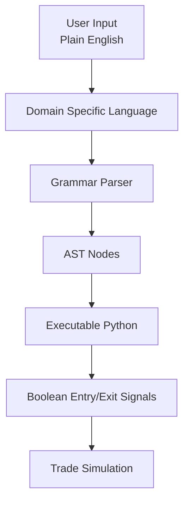
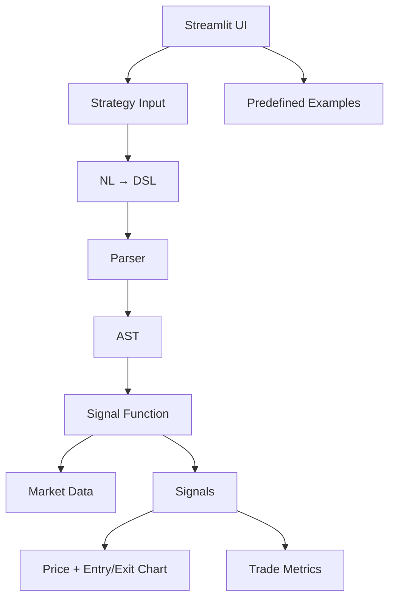
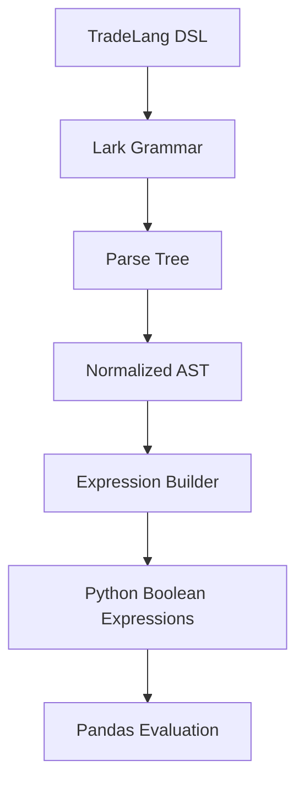

# TradeLang 🚀

**Natural Language → DSL → Executable Trading Strategies**

TradeLang is a **compiler-style trading strategy engine** that allows users to write trading strategies in **plain English**, converts them into a **deterministic domain-specific language (DSL)**, parses them into an **AST**, and executes them on market data with **signal visualization and backtesting**.

This project demonstrates **NLP, language design, parsing, and execution pipelines**, wrapped in an interactive **Streamlit UI**.

---

## ✨ Key Features

* 🧠 **Natural Language Strategy Input**
* 📜 Automatic conversion to a **custom trading DSL**
* 🌳 DSL parsed into an **Abstract Syntax Tree (AST)**
* ⚙️ AST compiled into **executable Python logic**
* 📈 **Entry & Exit signal generation**
* 💹 Simple **backtesting engine**
* 📊 **Price chart with entry (🟢) and exit (🔴) markers**
* 🖥️ Interactive **Streamlit interface**
* 🛡️ Guided input to avoid invalid strategies

---

## 🏗️ High-Level System Architecture


```mermaid
flowchart TD
    A[Natural Language Strategy] --> B[NL → DSL Converter]
    B --> C[TradeLang DSL]
    C --> D[DSL Parser<br/>(Lark Grammar)]
    D --> E[Abstract Syntax Tree (AST)]
    E --> F[AST → Python Codegen]
    F --> G[Signal Engine]
    G --> H[Backtesting Engine]
    H --> I[Results & Metrics]
    G --> J[Entry / Exit Signals]
    J --> K[Price Chart Visualization]
```

---

## 🧠 Compiler-Style Pipeline (Detailed)




---

## 🖥️ Streamlit UI Architecture




---

## 🔍 DSL Execution Internals




---


## 📂 Project Structure

```
TradeLang/
│
├── app.py                 # Streamlit UI
├── nl_to_dsl.py           # Natural language → DSL converter
├── dsl_parser.py          # Lark-based DSL grammar + AST builder
├── ast_python.py          # AST → executable Python expressions
├── backtest.py            # Simple backtesting engine
├── requirements.txt
└── README.md
```

---

## 🧪 Supported Strategy Patterns

### ENTRY conditions

* Close price above moving average
* Price crossing above moving average
* Volume thresholds
* Combined conditions using `AND`

### EXIT conditions

* RSI thresholds
* Price crossing below moving average
* Volume thresholds

### Example

```
Buy when price crosses above the 20-day moving average.
Exit when price crosses below the 20-day moving average.
```

---

## 🖥️ Streamlit Interface

The UI guides users to write **valid strategies only**, preventing grammar or execution errors.

Features:

* Strategy input box
* Predefined example strategies
* Generated DSL preview
* Backtest summary
* Signal counts
* Price chart with entry & exit markers

---

## ▶️ How to Run

### 1️⃣ Install dependencies

```bash
pip install -r requirements.txt
```

### 2️⃣ Start the Streamlit app

```bash
streamlit run app.py
```

Open the browser at:

```
http://localhost:8501
```

---

## 📈 Demo Strategy (Recommended)

```
Buy when price crosses above the 20-day moving average.
Exit when price crosses below the 20-day moving average.
```

Expected behavior:

* Multiple entry and exit signals
* Visible trades
* Clear green (entry) and red (exit) markers on the chart

---

## 🧠 Design Philosophy

* **Constrained natural language** instead of free-form English
* Deterministic parsing instead of probabilistic execution
* Grammar-driven DSL for reliability
* Explicit AST for explainability
* No forced trades — exits must be logically satisfied

This mirrors how **real-world DSLs and rule engines** are built.

---

## ⚠️ Known Limitations

* Limited vocabulary (intentional)
* No position sizing or risk management (yet)
* Uses synthetic price data for demos
* Backtesting logic is simplified

---

## 🚀 Future Enhancements

* CSV price data upload
* RSI & SMA overlays on chart
* Stop-loss / take-profit DSL support
* Trade PnL annotations
* Multi-asset support
* Strategy validation & diagnostics
* Deployment on Streamlit Cloud

---

## 👤 Author

Built by **Rishabh Sharma**
Focus areas: Generative AI, DSLs, ML systems, and applied AI engineering.

---

